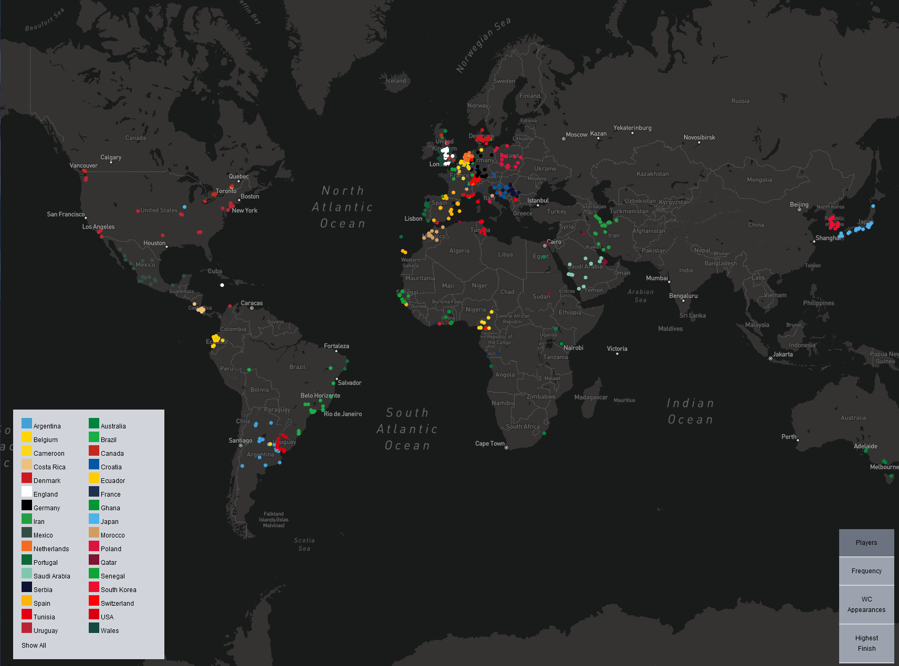

## Overview

This project maps the birthplaces of all the players at Qatar 2022, as well as having maps showing frequency per country, each country's highest appearance, and number of appearances. The project also includes data visualizations with various analysis.

The project was initially created for a class at the University of Washington, where the goal was to make ArcGIS story maps. The dataset was then repurposed for this web application, which was built using Typescript, React, Next.js, Mapbox, and chartjs.

## Data Processing

To create this project, the following steps were taken:

1. Data was gathered from https://fdp.fifa.org/ and https://www.kaggle.com/datasets/cristianedelweiss/fifa-world-cup-2022-players?select=World+Cup+players+-+Dataset.csv
2. The raw dataset was cleaned using the Pandas library and the birth locations of the players were obtained from their Wikipedia pages using the Beautiful Soup library.
3. The Google Maps Geocoding API was used to obtain the latitude and longitude of the birthplaces in order to map them.
4. The shapefiles for the countries were taken from the ArcGIS World Countries shapefile, with the exception of the United Kingdom which was obtained from the GADM shapefile and merged.
5. Points were adjusted using the snap feature and any remaining issues were resolved manually.

## Local Development

To run this project locally, follow these steps:

1. Clone the repository
2. Run `npm install` to install the dependencies
3. Run `npm run start` to start the development server